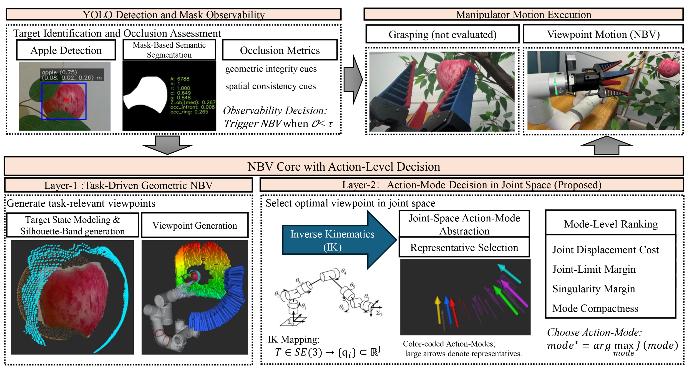
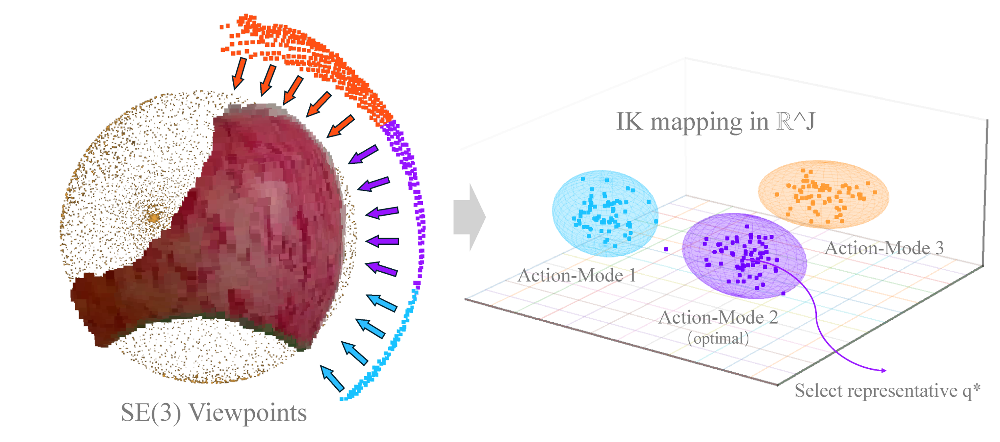
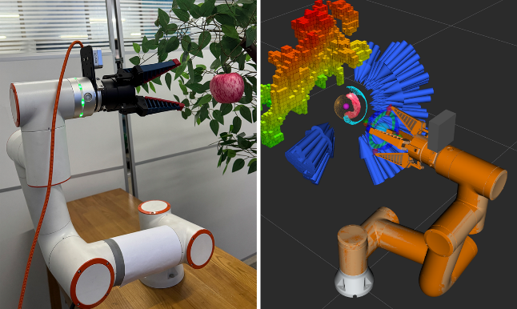

# Execution-Aware NBV Planning via Joint-Space Clustering

ROS implementation of an execution-aware Next-Best-View (NBV) planning framework for apple perception in orchard-Like environments.

This repository accompanies the manuscript **"Execution-Aware NBV Planning via Joint-Space Clustering for Apple Perception in Orchard-Like Environments"**. The system is designed for an eye-in-hand RGB-D camera mounted on a 6-DoF manipulator, where perception-favorable viewpoints must also be feasible, safe, and efficient to execute.



## Highlights

- Dual-layer NBV pipeline that links task-space viewpoint generation with joint-space execution reasoning.
- Silhouette-band candidate generation for occluded single-target apple perception.
- IK-feasible joint-space sampling followed by Action-Mode clustering.
- Execution-aware representative selection using joint motion cost and conservative kinematic margins.
- Real robot validation in a controlled mock-orchard setup with 60 paired trials.

In the reported experiments, the proposed Layer-1 + Layer-2 pipeline improves planning success from **73.3%** to **93.3%**, reduces joint-space motion cost by about **40%**, and increases joint-limit safety margin by about **28%** compared with an IK-filtered Layer-1 baseline.

## Method Overview

Occlusion from leaves and branches can make a visually informative NBV target unreliable to execute. The core idea of this repository is to avoid selecting viewpoints only in task space. Instead, candidate camera poses are first generated and scored for perception, then mapped into feasible robot joint configurations for execution-aware selection.

### Layer 1: Task-Space NBV Generation

Layer 1 generates candidate camera poses around the target apple under geometric and visibility constraints. The target surface is reconstructed from RGB-D observations and a lightweight spherical prior. Candidate viewpoints are generated near the silhouette band and evaluated using predicted surface coverage (PSC).

### Layer 2: Joint-Space Action-Mode Selection

Layer 2 maps Layer-1 candidate viewpoints into joint space through IK sampling. Feasible joint configurations are grouped into Action-Modes, which represent execution-similar solution regions. The final NBV target is selected at the mode level by considering perception utility, joint-space motion cost, joint-limit margin, singularity margin, and motion-planning feasibility.



## System Setup

The implementation was tested with the following setup:

| Component | Configuration |
| --- | --- |
| Robot | 6-DoF collaborative manipulator |
| Camera | Intel RealSense D405, eye-in-hand |
| Perception | YOLOv8 instance segmentation |
| Reconstruction | RGB-D back-projection and sphere fitting |
| Planning | MoveIt motion planning |
| Middleware | ROS Noetic |



## Repository Layout

```text
catkin_ws/
├── README.md
├── LICENSE
└── src/
    └── nbv_ros/
        ├── launch/                 # ROS launch files
        ├── scripts/                # Perception, reconstruction, NBV, and execution nodes
        ├── experiment/             # Recorded paired-trial data and analysis scripts
        ├── weights/                # Model weight directory
        ├── docs/images/            # README figures
        ├── CMakeLists.txt
        ├── package.xml
        └── README.md
```

## Requirements

Recommended environment:

- Ubuntu 20.04
- ROS Noetic
- Python 3.8+
- MoveIt
- OpenCV
- PyTorch
- Ultralytics YOLOv8
- Intel RealSense SDK 2.53.1

External ROS packages used by this repository:

- RealSense ROS driver: <https://github.com/IntelRealSense/realsense-ros>
- Ultralytics ROS: <https://github.com/Alpaca-zip/ultralytics_ros>
- Robot and MoveIt configuration package, expected as `frcobot_ros-master` in the workspace

## Installation

Create a catkin workspace and clone the required repositories:

```bash
mkdir -p ~/catkin_ws/src
cd ~/catkin_ws/src

git clone https://github.com/liu410/Execution-Aware-NBV-Planning-via-Joint-Space-Clustering.git nbv_ros
git clone https://github.com/realsenseai/realsense-ros.git
git clone -b noetic-devel https://github.com/Alpaca-zip/ultralytics_ros.git

python3 -m pip install -r ultralytics_ros/requirements.txt
```

The workspace is expected to contain:

```text
catkin_ws/
└── src/
    ├── nbv_ros/
    ├── realsense-ros/
    ├── frcobot_ros-master/
    └── ultralytics_ros/
```

Install common ROS dependencies:

```bash
sudo apt install -y \
  build-essential \
  python3-catkin-tools \
  python3-pip \
  python3-pykdl \
  python3-rosinstall \
  python3-rosinstall-generator \
  python3-wstool \
  ros-noetic-gazebo-ros-control \
  ros-noetic-gazebo-ros-pkgs \
  ros-noetic-joint-state-publisher \
  ros-noetic-joint-state-publisher-gui \
  ros-noetic-kdl-parser-py \
  ros-noetic-moveit \
  ros-noetic-moveit-ros-move-group \
  ros-noetic-moveit-ros-planning \
  ros-noetic-moveit-ros-planning-interface \
  ros-noetic-moveit-simple-controller-manager \
  ros-noetic-octomap-server \
  ros-noetic-ompl \
  ros-noetic-robot-state-publisher \
  ros-noetic-ros-control \
  ros-noetic-ros-controllers \
  ros-noetic-rviz \
  ros-noetic-rviz-visual-tools \
  ros-noetic-xacro
```

Build and source the workspace:

```bash
cd ~/catkin_ws
catkin_make
source devel/setup.bash
```

Additional dependencies may be required depending on your robot configuration, RealSense installation, and Python environment. If compilation reports missing packages, install them according to the terminal output.

## Running the System

Open separate terminals and source the workspace in each one:

```bash
cd ~/catkin_ws
source devel/setup.bash
```

### Terminal 1: ROS Master

```bash
roscore
```

### Terminal 2: Robot and MoveIt

For simulation:

```bash
roslaunch fr3_moveit_config demo_simulation.launch
```

For hardware:

```bash
roslaunch fr3_moveit_config demo_hardware.launch
```

### Terminal 3: Eye-in-Hand Camera

```bash
roslaunch nbv_ros realsense_in_hand.launch
```

### Terminal 4: Perception and Target Reconstruction

```bash
rosrun nbv_ros apple_segmentation_detector.py
rosrun nbv_ros apple_reconstruction.py
```

### Terminal 5: Point Cloud Filtering and OctoMap

```bash
rosrun nbv_ros point_filter.py
roslaunch nbv_ros octomap_server.launch
```

`point_filter.py` and `octomap_server.launch` are used to set up the planning context for NBV raycasting. After the required OctoMaps appear in RViz, `point_filter.py` may be stopped with `Ctrl+C`; the OctoMaps remain active.

### Terminal 6: NBV Generation and Execution

Generate silhouette-band samples and Layer-1 NBV candidates:

```bash
rosrun nbv_ros silhouette_detector.py
rosrun nbv_ros silhouette_nbv_analyzer.py
```

Run the proposed Layer-1 + Layer-2 method:

```bash
rosrun nbv_ros nbv_selector_action_mode.py
rosrun nbv_ros nbv_executor_action_mode.py
```

## Main Scripts

| Script | Purpose |
| --- | --- |
| `apple_segmentation_detector.py` | YOLOv8-based apple mask detection |
| `apple_reconstruction.py` | RGB-D target reconstruction and geometric modeling |
| `point_filter.py` | Point cloud filtering for planning context |
| `silhouette_detector.py` | Silhouette-band extraction |
| `silhouette_nbv_analyzer.py` | Layer-1 candidate viewpoint generation and PSC evaluation |
| `nbv_selector_action_mode.py` | Layer-2 Action-Mode clustering and execution-aware NBV selection |
| `nbv_executor_action_mode.py` | Execution of the selected NBV configuration through MoveIt |
| `mask_quality_quantifier.py` | Mask quality and occlusion-related observation metrics |
| `singularity_monitor.py` | Online singularity-related kinematic monitoring |

## Experiments

The experiment directory contains the paired-trial data and analysis scripts used in the manuscript:

```bash
cd ~/catkin_ws/src/nbv_ros/experiment

python3 merge_experiments.py
python3 make_three_line_table.py
python3 paired_trial_analysis.py
python3 make_combined_box_and_slope.py
```

For details, see [src/nbv_ros/experiment/README.md](src/nbv_ros/experiment/README.md).

## Running New Paired Experiments

The baseline method, Layer-1 + IK-only, is located in:

```bash
cd ~/catkin_ws/src/nbv_ros/experiment/L1+IK_only
python3 nbv_selector_ik_only.py
python3 nbv_executor_IK_only.py
```

The proposed method, Layer-1 + Layer-2, is located in:

```bash
cd ~/catkin_ws/src/nbv_ros/experiment/L1+L2
python3 nbv_selector_action_mode.py
python3 nbv_executor_action_mode.py
```

Each run generates CSV logs for statistical analysis. For paired analysis, place logs into matching numbered trial folders under `L1+IK_only/` and `L1+L2/`.

If a CSV file contains multiple rows because MoveIt attempted planning more than once, keep only the first row for consistency with the reported analysis.

## Citation

If you use this repository in academic work, please cite the published article:

```bibtex
@article{niu2026execution,
  title = {Execution-Aware NBV Planning via joint-space clustering for apple perception in orchard-like environments},
  author = {Niu, Jinxing and Liu, Chang and Yang, Jie and Wang, Yuhang and Ma, Dingyi and Zhang, Tao},
  journal = {Smart Agricultural Technology},
  volume = {14},
  pages = {102220},
  year = {2026},
  doi = {10.1016/j.atech.2026.102220},
  url = {https://doi.org/10.1016/j.atech.2026.102220}
}
```

## Notes and Limitations

- The current implementation targets controlled, static, single-target mock-orchard trials.
- The robot description and MoveIt configuration are expected to be available through the external robot package.
- The repository contains research code; paths, topics, thresholds, and model weights may need adjustment for a different manipulator, camera, or orchard scene.

## License

This project is released under the MIT License. See the [LICENSE](LICENSE) file for details.
