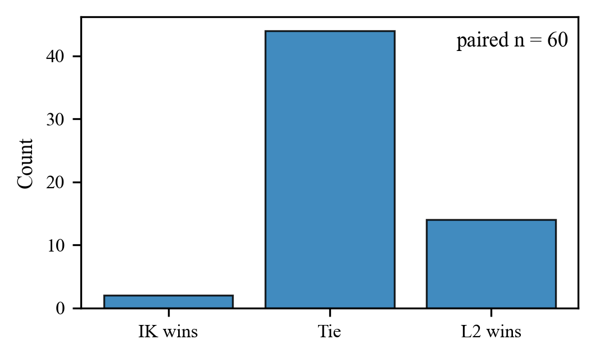
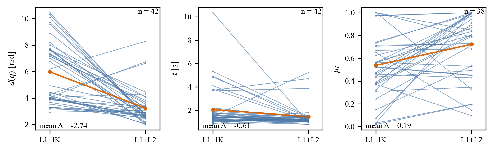

# Experiment Logs and Analysis

This directory contains the recorded results and analysis scripts for the paired experiments reported in the manuscript **"Execution-Aware NBV Planning via Joint-Space Clustering for Apple Perception in Orchard-Like Environments"**.

The experiments compare two NBV planning strategies under approximately matched occlusion conditions:

- **L1+IK-only**: Layer-1 viewpoint generation with IK-feasibility filtering.
- **L1+L2**: Layer-1 viewpoint generation followed by Layer-2 Action-Mode clustering and execution-aware selection.

Each `trial_id` pairs the two methods under the same experimental setup so that planning outcomes and motion-related metrics can be compared directly.

## Summary

The recorded dataset contains **60 paired trials**.

| Method | Trials | Successful plans | Planning success | Mean joint motion cost | Mean planning time | Mean joint-limit margin |
| --- | ---: | ---: | ---: | ---: | ---: | ---: |
| L1+IK-only | 60 | 44 | 73.3% | 6.04 rad | 2.06 s | 0.553 |
| L1+L2 | 60 | 56 | 93.3% | 3.65 rad | 1.68 s | 0.705 |

The proposed L1+L2 pipeline improves planning success, reduces selected joint-space motion cost, and increases the joint-limit safety margin while keeping planning time in the same practical range.





## Directory Overview

```text
experiment/
├── L1+IK_only/
│   ├── 1/
│   │   ├── mask_data.txt
│   │   └── nbv_executor_IK_only_xxx.csv
│   ├── 2/
│   └── ...
├── L1+L2/
│   ├── 1/
│   │   ├── mask_data.txt
│   │   └── nbv_executor_action_mode_xxx.csv
│   ├── 2/
│   └── ...
├── merge_experiments.py
├── paired_trial_analysis.py
├── paired_trial_analysis_combined.py
├── make_three_line_table.py
├── make_combined_box_and_slope.py
├── all_experiments_summary.csv
├── paired_summary.csv
├── summary_table.csv
├── summary_table.tex
├── fig_paired_outcome.png
├── fig_paired_deltas.png
├── fig_paired_slope_3panel.png
└── README.md
```

## Data Files

| File | Description |
| --- | --- |
| `L1+IK_only/<trial_id>/` | Logs for the baseline method in each paired trial |
| `L1+L2/<trial_id>/` | Logs for the proposed method in each paired trial |
| `mask_data.txt` | Observation and mask-quality information for a trial |
| `nbv_executor_*.csv` | Motion-planning and execution-side metrics generated by the executor |
| `all_experiments_summary.csv` | Merged per-method trial summary |
| `paired_summary.csv` | Trial-wise paired comparison table |
| `summary_table.csv` | Compact global statistics table |
| `summary_table.tex` | LaTeX version of the compact statistics table |

## Analysis Scripts

| Script | Output |
| --- | --- |
| `merge_experiments.py` | Builds `all_experiments_summary.csv` from the numbered trial folders |
| `make_three_line_table.py` | Builds `summary_table.csv` and `summary_table.tex` |
| `paired_trial_analysis.py` | Builds paired statistical summaries and paired-difference plots |
| `paired_trial_analysis_combined.py` | Alternative combined paired-analysis script |
| `make_combined_box_and_slope.py` | Builds the combined paired box/slope visualization |

## Reproduce the Reported Statistics

Run the analysis scripts from this directory:

```bash
cd ~/catkin_ws/src/nbv_ros/experiment

python3 merge_experiments.py
python3 make_three_line_table.py
python3 paired_trial_analysis.py
python3 make_combined_box_and_slope.py
```

Expected generated outputs include:

```text
all_experiments_summary.csv
paired_summary.csv
summary_table.csv
summary_table.tex
fig_paired_outcome.png
fig_paired_deltas.png
fig_paired_slope_3panel.png
```

## Run New Experiments

For a new paired experiment, create matching numbered folders in both method directories:

```text
L1+IK_only/<trial_id>/
L1+L2/<trial_id>/
```

Run the baseline method:

```bash
cd ~/catkin_ws/src/nbv_ros/experiment/L1+IK_only
python3 nbv_selector_ik_only.py
python3 nbv_executor_IK_only.py
```

Run the proposed method:

```bash
cd ~/catkin_ws/src/nbv_ros/experiment/L1+L2
python3 nbv_selector_action_mode.py
python3 nbv_executor_action_mode.py
```

Move the generated logs into the corresponding numbered folders, then rerun the analysis scripts from the root of `experiment/`.

## Important Logging Note

Some executor CSV files may contain multiple rows because MoveIt can attempt motion planning more than once, for example after an initial failed plan. For consistency with the reported paired analysis, keep only the first row of each generated CSV before running `merge_experiments.py`.

## Metrics

| Metric | Meaning |
| --- | --- |
| Planning success | Whether MoveIt returned a collision-free trajectory within the time budget |
| Joint-space motion cost | Weighted joint displacement from the initial configuration to the selected NBV configuration |
| Planning time | MoveIt planning time for the selected NBV motion |
| Joint-limit margin | Conservative normalized distance from joint limits |
| View success | Whether the post-move observation satisfies the perception-side target condition |
